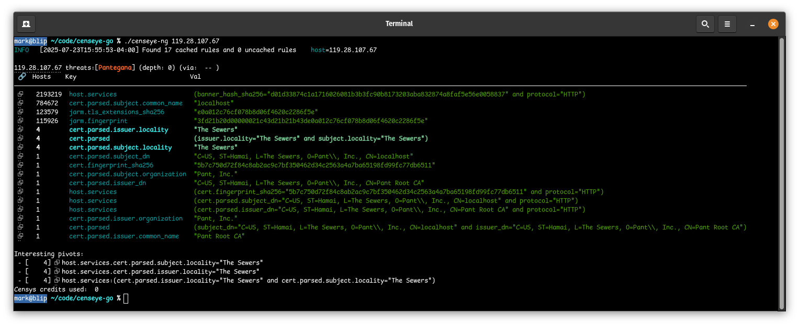
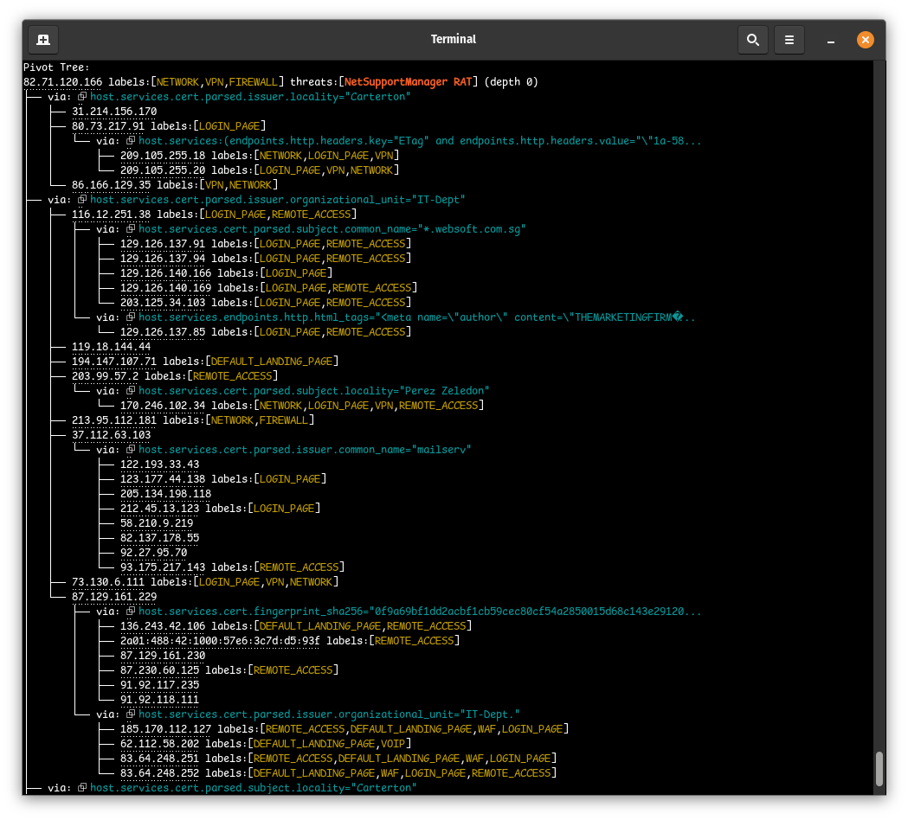
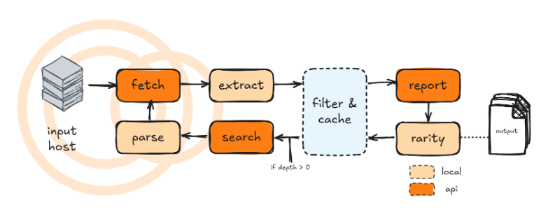

# Censeye-NG

Censeye-NG is an example API and utility for working with the Censys Threat Hunting module. It works much like the original [Censeye](https://github.com/censys-research/censeye) tool for Censys Search, but utilizes various new features of the Censys Platform API to provide a faster and more flexible experience.

Thanks to the new [ValueCounts](https://docs.censys.com/reference/v3-threathunting-value-counts) endpoint—an API purpose-built for threat hunting: operations that previously took minutes can now complete in seconds. This endpoint allows you to batch multiple queries and quickly retrieve result counts for each, dramatically speeding up pivoting workflows.

In the original Censeye, pivots were limited to a hand-curated whitelist of "interesting" fields to avoid excessive query overhead. As a result, potentially valuable pivots were often missed. With Censeye-NG, that limitation is gone—you can now pivot on *any* field returned in the dataset, unlocking far more flexibility and depth in your analysis.

Even more powerful, Censeye-NG supports constructing compound queries. For example, suppose a host has the following certificate issuer:

```
C=Earth, ST=Cyberspace, L=Somewhere, O=Chrome, OU=SSL-RSA, CN=051
```

This issuer alone may match thousands of hosts. But if the host you're investigating also used the protocol `UNKNOWN`, Censeye-NG will combine both attributes into a single query:

```
host.services:(cert.parsed.issuer_dn="C=Earth, ST=Cyberspace, L=Somewhere, O=Chrome, OU=SSL-RSA, CN=051" and protocol="UNKNOWN")
```

This refined query may reveal only a handful of hosts, say, 15, which makes for a highly compelling pivot target.

## Warning

- To use the features in this tool, you must have a valid access to the Censys Threat Hunting module, which is a paid feature of the Censys Platform.
- Censeye-NG can generate a large number of queries, especially when the depth is greater than zero.
- Censeye-NG is an experimental tool that is used by our research team, but it is not an official Censys product. It is provided as-is, without any guarantees or support.

## Building

**Requires Go 1.8 or later.**

```bash
$ make
```

Optionally, you can run:

```
$ go install github.com/censys-research/censeye-ng@latest
```

To install just the utility.

## Usage

Censeye-ng attempts to be backwards compatible with the original Censeye tool, so you can use it in the same way. However, it also introduces new features and options that enhance its functionality.

```
$ censeye-ng --help
Usage:
  censeye-ng [flags]
  censeye-ng [command]

Available Commands:
  compile     Compile Censeye queries from a file
  completion  Generate the autocompletion script for the specified shell
  help        Help about any command

Flags:
  -a, --at string                 Fetch host data from a specific date (e.g., '2023-10-01 12:00:00')
      --at-time string            alias for --at
  -C, --cache-duration duration   Duration to keep the cache (default: 23h) (default 168h0m0s)
  -c, --config string             Path to the configuration file
  -d, --depth int                 Depth of the scan (default: 0)
  -h, --help                      help for censeye-ng
  -L, --log-level string          Log level (debug, info*, warn, error, fatal, panic)
      --no-color                  Disable colored output
      --no-link                   Disable hyperlinks in output
  -O, --org string                Organization ID
  -o, --output string             Output format (pretty / json) (default "pretty")
  -p, --pivot-threshold int       maximum number of hosts for a search term that will trigger a pivot (default -1)
      --pivotable strings         fields that should be considered for pivoting when depth > 1 (can be specified multiple times)
      --showconf                  Show the configuration file in YAML format before running the command
      --workers int               Number of parallel workers (for auto-pivot feature only) (default 3)
```

You must have a valid Censys API key and organization to use Censeye-NG. You can set these using environment variables:

```
CENSYS_PLATFORM_TOKEN=$YOUR_API_KEY
CENSYS_PLATFORM_ORGID=$YOUR_ORG_ID
```

### Example

#### Single Host Analysis

```bash
$ censeye-ng 159.75.155.46 --depth 2
```

This will collect the host information from `159.75.155.46` from Censys, generate a list of all possible pivot fields, optimize and filter them, generate a valid ValueCounts query, and then execute it against the Censys Platform API. Then, since the `--depth` is set to `2`, it will recursively pivot on the results, collecting more information and generating new queries until the depth limit is reached. By default, the depth is set to `0`, which means no recursive pivoting will occur.

It should be noted that when the depth is greater than zero, the API will be queried in parallel, which can significantly speed up the process. The number of parallel queries can be controlled with the `--parallel` flag (default is `2`).

#### Multi-IP Common Attribute Analysis

Censeye-NG supports multiple input methods for analyzing common attributes across multiple hosts:

**Direct arguments (handles spaces gracefully):**
```bash
$ censeye-ng 1.2.3.4 5.6.7.8 9.10.11.12
$ censeye-ng "1.2.3.4, 5.6.7.8, 9.10.11.12"
$ censeye-ng 1.2.3.4,5.6.7.8,9.10.11.12
```

**Stdin input (original method):**
```bash
$ echo "1.2.3.4,5.6.7.8,9.10.11.12" | censeye-ng
```

All methods analyze the provided IP addresses to find common attributes across all hosts. The output shows:

- **Host_Set**: How many of the provided IPs share this attribute
- **Hosts**: Total count of this attribute in the global Censys dataset

This helps identify distinctive characteristics shared across a cluster of hosts. For example:

```
Common Attributes Analysis:
🔗    Set       Hosts    Key                    Val
      3         46       cert.issuer_dn         "C=Earth, ST=Cyberspace..."
      3         150000   protocol               "HTTP"
```

In this example:
- First row: All 3 IPs share a certificate issuer, but only 46 total hosts globally have it → **distinctive attribute**
- Second row: All 3 IPs use HTTP, but 150k hosts globally use HTTP → **common, not distinctive**

Note: Multi-IP mode does not support the `--depth` flag as recursive pivoting would be ambiguous with multiple starting points.

## Interpreting a report

Every host that is queried will generate a report that always begin with the following information:

1. The host IP address
2. Labels associated with the host (e.g., `REMOTE_ACCESS`, `CAMERA`, `IOT`)
3. Threats associated with the host (e.g., `NetSupportManager RAT`, `Cobalt Strike`, `Sliver`)
4. The depth of the current search (e.g., `depth: 1`)
5. The parent IP address and the specific CenQL query that brought us to this current host
6. A list of all matching queries that can be used to discover this host that existed on the parent

Take the following report header as an example:

```
190.231.88.140 labels:[WEB_UI,REMOTE_ACCESS,CAMERA,IOT,LOGIN_PAGE] threats:[NetSupportManager RAT] (depth: 1) (via: 82.71.120.166 -- host.services.endpoints.banner_hash_sha256="f5058dcb7e642da26630899eeef4ee4019342cc2ce7bc9271c763908649942fc")
Parent IP: 82.71.120.166
All matching queries:
 - ⮺ host.services.endpoints.banner_hash_sha256="f5058dcb7e642da26630899eeef4ee4019342cc2ce7bc9271c763908649942fc"
 - ⮺ host.services:(banner_hash_sha256="f5058dcb7e642da26630899eeef4ee4019342cc2ce7bc9271c763908649942fc" and protocol="HTTP")
```

The host `190.231.88.140` was discovered via a prior Censeye run on `82.71.120.166`, the final query that was used to discover it was:

```
host.services.endpoints.banner_hash_sha256="f5058dcb7e642da26630899eeef4ee4019342cc2ce7bc9271c763908649942fc"
```

But the parent also had a second query that could have been used to discover it:

```
host.services:(banner_hash_sha256="f5058dcb7e642da26630899eeef4ee4019342cc2ce7bc9271c763908649942fc" and protocol="HTTP")
```
----



The rest of a single report will contain a table consiting of the following columns:

- **Query Hyperlink**: A clickable link to the Censys Platform API that will execute the query (only rendered if the terminal supports links)
- **Hosts**: the number of hosts that matched the query in this row
- **Key**: The scope of the query (e.g., `host.services.cert`)
- **Val**: The value of the query (e.g., `parsed.issuer_dn="C=Earth, ST=Cyberspace, L=Somewhere, O=Chrome, OU=SSL-RSA, CN=051"`)

We should note that rows that are highlighted/bold are queries that are deemed "interesting", or, in other words, if the depth is greater than zero, these queries would be used to discover new hosts. The threshold for what is considered "interesting" is controlled by the `--pivot-threshold` flag (default is `150`).

We then see an "Interesting pivots" section, which is an aggregate view of all the interesting queries that were generated during the run (along with a hyperlink to the Censys Platform).

If censeye was run with a depth greater than zero, then a final section is displayed: the "Pivot Tree"



In the above example, we ran censeye-ng using a depth of `2`, so let's break this down using a subset of the output:

```
82.71.120.166 labels:[VPN,NETWORK,FIREWALL] threats:[NetSupportManager RAT] (depth 0)
├── via: ⮺ host.services.cert.parsed.issuer.locality="Carterton"
│   ├── 31.214.156.170
│   ├── 80.73.217.91 labels:[LOGIN_PAGE]
│   │   └── via: ⮺ host.services:(endpoints.http.headers.key="ETag" and endpoints.http.headers.value="\"1a-58f89dce770c0\"")
│   │       ├── 209.105.255.18 labels:[LOGIN_PAGE,VPN,NETWORK]
│   │       └── 209.105.255.20 labels:[VPN,NETWORK,LOGIN_PAGE]
│   └── 86.166.129.35 labels:[VPN,NETWORK]
```

Here we started out with the host `82.71.120.166` which had a few "interesting queries", including the one listed:

```
host.services.cert.parsed.issuer.locality="Carterton"
```

Using this query we found three new hosts:

- `31.214.156.170`
- `86.166.129.35`
- `80.73.217.91`

While censeye runs on `31.214.156.170` and `86.166.129.35` produced no "interesting fields", we see that `80.73.217.91` _did_:

```
host.services:(endpoints.http.headers.key="ETag" and endpoints.http.headers.value="\"1a-58f89dce770c0\"")
```

This query was used to discover two more hosts:

- `209.105.255.18`
- `209.105.255.20`

In summary, branches prefixed with the string `via:` are queries that were found on the parent host that were used to discover the child hosts. Each child host can have its own set of queries that were used to discover them, and so on, recursively.

## Configuration

While censeye-ng comes with what we consider "sane" defaults, anyone can override sections of it via a YAML configuration file. If you want to dump the running configuration, you can use the `--showconf` flag, which will print the configuration in YAML format to stdout.

### Rarity

```yaml
rarity:
    min: 2
    max: 50
```

The `rarity` section allows you to define the minimum and maximum number of hosts that a query must match to be considered "interesting". The default values are `2` and `50`, respectively. This means that any query that matches fewer than 2 hosts or more than 50 hosts will not be considered for pivoting. Optionally, you can pass the `--pivot-threshold` flag to override the maximum value.


### Cache Duration

```yaml
cache_duration: 168h0m0s
```

The `cache_duration` section allows you to define how long the cache should be kept. The default value is `168h0m0s`, which is equivalent to 7 days. This means that any host or search results that are cached will be kept for 7 days before being overwritten.

Note that this uses lazy expiration, meaning that the cache is only updated when a host is queried. If you run Censeye-NG on the same host multiple times within the cache duration, it will not hit the API again, but rather return the cached results.

### Workers

```yaml
workers: 3
```


The `workers` section allows you to define the number of concurrent workers that will be used to process the queries. The default value is `3`, which means that Censeye-NG will run up to 3 queries in parallel. It's highly suggested to keep this value low, as the Censys Platform API may block or rate-limit you if you send too many requests in a short period of time. If you want to increase the number of workers, you can do so, but be aware that this may lead to rate-limiting issues.

Optionally, you can use the `--workers` flag to control this number. 

### Extraction Rules

```yaml
extraction_rules:
    - fields:
        - tls.ja4s
        - protocol
    - fields:
        - cert.fingerprint_sha256
        - protocol
    - fields:
        - cert.parsed.subject_dn
        - protocol
    - scope: endpoints
      fields:
        - http.protocol
        - http.status_code
        - http.status_reason
```

Since we are now able to generate queries based on any field in the host data, we can also define custom extraction rules that will generate compound queries based on the presence of multiple fields. To do this, you can define a list of `extraction_rules` in the configuration file. Each rule can specify a list of `fields` that must all be present in the host data to generate a query. In the example above we see an "endpoint" scope that will generate a query like:

```
host.services.endpoints:(http.protocol="HTTP/1.1" and http.status_code="200" and http.status_reason="OK")
```

But only if all three of those fields exist in the host data to begin with.

## Global field filters

```yaml
filters:
    - host.whois.
    - host.dns.
    - host.location.
    - host.services.threats.
    - host.services.scan_time
    - host.services.transport_protocol
    - host.ip
    - host.services.ja4tscan.scan_time
    - host.service_count
    - host.autonomous_system.
```

The `filters` section allows you to define a list of fields that should be ignored by Censeye-NG when generating queries. This is useful for excluding fields that are not relevant to your analysis or that may lead to excessive query counts. Any field that matches the prefix will be ignored, including wildcard fields (e.g., `host.whois.` will ignore all fields that start with `host.whois.`). When a field doesn't have a dot suffix, it will only match that exact field name (e.g., `host.ip` will ignore the `host.ip` field, but not `host.ipv6`).

It should be noted that anything defined in this section will be applied globally, and any fields or subfields that match the prefixes cannot be used in a `extraction_rules` rule.

## Regex query filters

```yaml
re_filters:
    - ^host\.services\.endpoints\.http\.protocol="HTTP/1\.[01]"$
    - ^host\.services\.endpoints\.path="(/|/robots\.txt)"
    - (?i)^host\.services:\(endpoints\.http\.headers\.key="date" and endpoints\.http\.headers\.value="<REDACTED>"\)$
```

These are regex patterns that will be used to filter out queries that match them. This is useful for excluding common queries that are not relevant to your analysis, such as `host.services.endpoints.http.protocol="HTTP/1.1"` or `host.services.endpoints.path="/"`. Unlike `filters`, these regex patterns are applied to the final queries that are generated, so you can use individual fields in `extraction_rules` that may match these patterns.

## Behind the Scenes of Censeye's Recursive Pivoting



As stated before, at its core, Censeye is a recursive, depth-first pivoting engine built for automated threat hunting using the Censys Platform API. It starts with a single host and intelligently walks the graph of related infrastructure, generating and executing queries based on what it discovers. Let’s walk through how this system works under the hood.

### Step 1: Bootstrapping

when `censeye.New()` is called, the tool is configured with:

- A Censys API client, which is used to interact with the Censys Platform API.
- A local cache directory (defaults to ~/.censeye)
- The number of concurrent workers
- Cache duration (for both host and search results)

### Step 2: Kicking off a run

A run begins with:

```go
censeye.Run(ctx, host, depth, options...)
```

This triggers the analysis process starting from the specified `host`, with optional settings (`options`) like:

- Historical snapshot of the `host` (using `WithAtTime`)
- Max recursion depth (using `WithDepth`)

### Step 3: Initial host analysis

When `Run()` is called, under the hood it calls:

1. `getHost()` retrieves the full asset data from either the cache, or the API
2. `compileRules()` inspects the host's data (labels, endpoints, certificates, headers, etc...) and generates a list of valid CenQL queries.
3. `getCounts()` submits the generated queries in bulk to the Censys value-counts API, which returns a count of how many other hosts that match each query.
4. A report is generated with all rule hits that include the following data:
   - Host info
   - Associated labels & threats
   - The depth of the current search
   - Referrer information (How the host was discovered)

### Step 4: Identifying new hosts

From the report generated in Step 3, `collectHosts()` filters the queries deemed "interesting" (e.g., those with non-zero but not-too-high hit counts), then executes them to fetch new hosts that match.

Each discovered host is paried with a `Referrer`, which tracks _which_ query from _which parent host_ discovered it.

### Step 5: Pivoting

Each new host is queued as a new task (`runTask`), and `runTask()` calls `runPivots()` to repeat the same process:

- Get host info → Compile rules → Get counts → Collect more hosts

This continues recursively with the depth and duplicate query tracking enforced by a shared state (`runState`). All of these tasks are processed in parallel.

### Step 6: Result aggregation

As results come back, they're stored in a slice of `censeye.Report` objects. Each report holds insight into how a host was discovered and what queries were made to find them.

The final result is a tree-like graph of pivoted host relationships that maps out the infrastructure similarity.

### Step 7: Output

Finally, the results are printed in a human-readable format, showing the relationships between hosts, the queries used to discover them, and any interesting fields that were found.

### Various Notes

- The new Platform API allows us to consolidate both search and host details into a single query, which is a significant improvement over the original Censeye. Also reduces query usage significantly.

## Censeye API

The censeye-ng tool also exposes an API that allows you to interact with it programmatically. This can be useful for integrating Censeye-NG into other tools or workflows.

### Rule compilation

Let's say you want to figure out how to generate a request to the ValueCounts API for a specific host. The censeye-ng API provides a way to compile rules using the raw JSON data returned from the Censys Platform API.

The following code will read a host result from stdin, compile the rules, and print the request that can be sent to the ValueCounts API:

```go
package main

import (
  "encoding/json"
  "fmt"
  "io"

  "github.com/censys-research/censeye-ng/pkg/censeye"
)

func main() {
    rawData, _ := io.ReadAll(os.Stdin)
    compiled, _ := censeye.CompileRulesFromHostResult(rawData)
    request, _ := json.Marshal(compiled)
    fmt.Println(string(request))
}
```

Alternatively you can just call the tool like so: `cat host.json | censeye-ng compile`, which will print the request to stdout.


